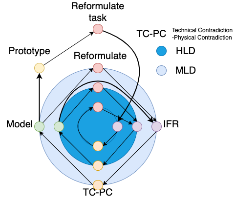

# Innovation methodology 

## Sources
https://www.youtube.com/watch?v=XKYsteB-KPk
https://en.wikipedia.org/wiki/TRIZ

## 40 principles of invention
https://altshuller.ru/triz/technique1.asp

http://www.ipface.org/pdfs/reading/TRIZ_Principles.pdf

### Principle 1. Segmentation 
(**model of 6: Divide and conquer**)

A. Divide an object into independent parts.

### Principle 5. Merging
(**model of 6: Correlation**)

A - Bring closer together (or merge) identical or similar objects or
operations in space.
Close to the separate the concerns principle.

### Principle 6. Universality
(**model of 6:  Elevation**)

...

### Principle 7. Russian Dolls “Nested Doll”

B - Place multiple objects inside others

### Principle 10. Preliminary Action
(**model of 6: Planing, Logical reasoning**)

...

### Principle 11. Beforehand Cushioning
(**model of 6: Planing**)

Back up!

### Principle 13. “The Other Way Round”
(**model of 6: Reformulation, Reasoning by analogy**)

Inverse dependency.

### Principle 20. Continuity of Useful Action.

B - Eliminate all idle or intermittent actions or work
Booted notebooks use.
...

### Principle 22. Blessing in Disguise
(**model of 6: Reformulation**)

A - Use harmful factors (particularly, harmful effects of the
environment or surroundings) to achieve a positive effect

Use arctic cold to cool a data-center.

### Principle 23. Feedback

### Principle 24. Intermediary

Proxy objects.

### Principle 25. Self-service

Self-test. 

### Principle 26. Copying
(**model of 6: Reformulation, Simulation, Use external representations**)

Reformulation.
Using computational models.
