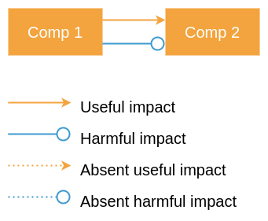
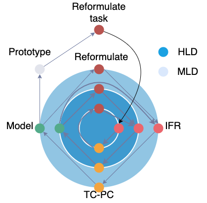
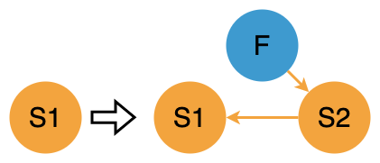
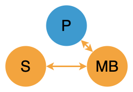
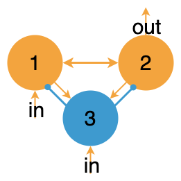
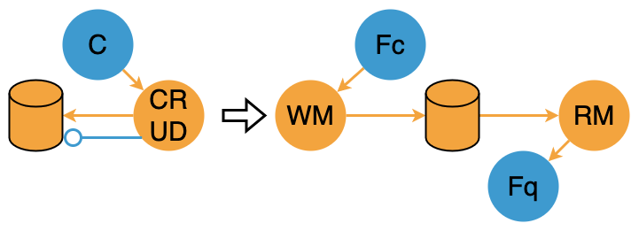

# Innovation methodology 

## Sources

https://en.wikipedia.org/wiki/TRIZ

https://altshuller.ru/triz/ariz85v.asp

https://www.youtube.com/watch?v=XKYsteB-KPk

https://en.wikipedia.org/wiki/Software_development_process

The proposed innovation methodology is based on the [ARIZ process](https://en.wikipedia.org/wiki/TRIZ) (Algorithm of inventive problems solving (in Russian)) and [Software development life-cycle](https://en.wikipedia.org/wiki/Software_development_process) (SDL).
The SDL contains the following phases: analysis, design, development and validation with further maintenance ... . 
As the Innovation methodology is focused main on solving technical problems 
here we take into account only analysis, design and early prototyping, they are influenced by ARIZ process.
The picture below contains simple waterfall SDL with mapped ARIZ activities
(below we indicate that with the influence of ARIZ it convolves into double-spiral process).

## Analysis and IFR

The analysis phase of the SDL usually contains the context description in the form of [context diagram](https://en.wikipedia.org/wiki/System_context_diagram) that corresponds ARIZ context and is extened with ARIZ context time activities.
Functional and non functional requirements are extended the description of ARIZ Ideal Final Result (**IFR**) in the following form:

	The X element, without additional complications of the system preserving all the useful functions of the system 
	DOES following:
		[useful actions] 
	IN [the context of the system]
	DURING [the context time].

Now we call it **IFR-1** and it stands for version 1 of high level view IFR. The **IFR-2** is the second version or the correction of the IFR after the analysis of the **Technical Contradiction**. The IFR-2 leads to the ARIZ **Modeling** activity.

## Design 

For the inventions/innovations we propose to use the one more approach in combination with ARIZ and SDL - the early prototyping. To develop the prototype as early as one can is crucial for the invention starting from the core functionality towards the *should have* functions of the system. This spiral approach is depicted in [double spiral diagram](#double-spiral-life-cycle).

### High level design

The design starts with the high level view (HLD) where we broadly try to understand the possible solution having functional and non functional requirements in hand as well as IFR.

#### Technical contradiction 

Firstly we have to identify the high level Technical Contradictions (**TC**) 
The technical contradiction is the central concept of ARIZ and identifies the technical obstacle to develop the IFR that we have to overcome using invention. 
According to ARIZ we put the TC in the form:

	IF [brief solution description]
	THEN [positive results]
	BUT [negative consequences]
	
We should identify at least two TCs describing opposite solutions, for example using wired and wireless connection.
Both of them should have positive results and negative consequences.

Draw the TCs diagrams according to the reworked ARIZ notation.

The rectangles (Sys1, Sys2) represent components of the system with two impacts useful and harmful in the same state of the system. The TC diagram revolves around the IFR and the technical impasse to develop and deliver the IFR.
To identify the wishful 
Using the absent useful and absent harmful impact arrows we could describe desired state of the IFR highlighting TC.
As soon as we have identified the first high-level TC we could use 
recommended TRIZ principle using the [TC table](https://docs.google.com/spreadsheets/d/1x6LbsFmVpPGD1LbLMwTWprrvV5PQQDLLoWGGCdHqn4Y/edit#gid=298366498)
and the [list of 40 principles](https://upload.wikimedia.org/wikipedia/commons/f/fa/1_Le_francais_-_40_principes_d%27invention%2C_2_L%27anglais_-_40_principles_of_invention%2C_3_L%27anglais_-_Contradiction_Matrix_in_TRIZ_method.pdf).
[TC table was adopted using this resource.](https://altshuller.ru/triz/technique2.asp)

#### Clarification of IFR 

The TC highlights reasons why we can not implement the IFR in a straightforward manner and if we can not define a satisfactory solution we must use the "step back from IFR" approach.
This way we consider less ideal final result and reformulate **IFR-1** into **IFR-2**.

#### Modeling (SDM)

Using the IFR-2 we can use the other ARIZ tool: the **Small Dwarfs Modeling** approach (SDM).
The SDM is form of wishful thinking:

	Imagine that you have powerful small dwarfs that could "magically" help you solve the problem.
	Draw the system with technical contradiction diagram and extend it with 
	the diagram with small dwarfs acting as technical solution.
	Substitute small dwarfs with technical system/solution.
	
If SDM does not help reformulate high level TC and IFR using one more "step back from IFR" and repeat SDM steps.

We could use this reformulation cycle till we find ourself dead end or find the solution.
In the first case we should reformulate the task 
In the later case we should get to the high level design description using for example UML diagrams and the "traditional" software design approach, with later mid level design description to get as fast as we can to the early prototype.

#### Using standards (Design patterns)

# ... Extend

### Mid level design 

The MLD phase contains similar to the HLD phases with the respect to the abstraction level that we take in account.
If HLD contains the bird eye view on components, deployment and overall behavior of components description the MLD should consist of drilling in the HLD component with sub-components, interfaces between components and internal components activity description.

The MLD could be the starting point of the early prototyping and the granularity of the MLD is usually enough to create "quick and dirty" solution to validate the basic functionality of the proposed solution.

# ... Reformulate text above in appropriate way

## Double spiral life-cycle

# ... Add IT examples below
## 40 principles of invention
https://altshuller.ru/triz/technique1.asp

http://www.ipface.org/pdfs/reading/TRIZ_Principles.pdf

### Principle 1. Segmentation 
(**model of 6: Divide and conquer**)

A. Divide an object into independent parts.

### Principle 5. Merging
(**model of 6: Correlation**)

A - Bring closer together (or merge) identical or similar objects or
operations in space.
Close to the separate the concerns principle.

### Principle 6. Universality
(**model of 6:  Elevation**)

...

### Principle 7. Russian Dolls “Nested Doll”

B - Place multiple objects inside others

### Principle 10. Preliminary Action
(**model of 6: Planing, Logical reasoning**)

...

### Principle 11. Beforehand Cushioning
(**model of 6: Planing**)

Back up!

### Principle 13. “The Other Way Round”
(**model of 6: Reformulation, Reasoning by analogy**)

Inverse dependency.

### Principle 20. Continuity of Useful Action.

B - Eliminate all idle or intermittent actions or work
Booted notebooks use.
...

### Principle 22. Blessing in Disguise
(**model of 6: Reformulation**)

A - Use harmful factors (particularly, harmful effects of the
environment or surroundings) to achieve a positive effect

Use arctic cold to cool a data-center.

### Principle 23. Feedback

### Principle 24. Intermediary

Proxy objects.

### Principle 25. Self-service

Self-test. 

### Principle 26. Copying
(**model of 6: Reformulation, Simulation, Use external representations**)

Reformulation.
Using computational models.

## Inventive Standards 
https://altshuller.ru/triz/standards.asp

https://altshuller.ru/world/eng/standards.asp

https://sites.google.com/site/otsmtriz/inventive-standards/class-1-1/group-1-1?authuser=0

### 1. Composition and Decomposition of S-Field systems

#### 1-1. Synthesis of S-Fields

https://altshuller.ru/triz/standards.asp#1

https://sites.google.com/site/otsmtriz/inventive-standards/class-1-1/group-1-1?authuser=0

Given an object S1 which is hard to control, 
and the conditions of the task do not contain any restrictions on the introduction of new substances and fields, 
the problem could be solved by synthesizing a new S-Field: 
the object is subjected to the action of a field via new substance S2 producing the necessary change over the object. 
The missing elements are introduced accordingly.

##### MVC

##### Pub-sub

##### Oscillator motif

#### 1-2. Decomposition of S-Fields

If there are two influences useful and harmful between two substances, we could solve the problem adding the proxy substance.

### 2. Evolution of S-Field systems

https://altshuller.ru/triz/standards.asp#2

https://sites.google.com/site/otsmtriz/inventive-standards/class-2?authuser=0

#### 2-1. A transition to integrate S-Fields

We can increase the efficiency of S-Fields using complex (chain, dual) S-Fields instead of simple ones.

#### 2.1.1. A transition to chain S-Field

https://www.ibm.com/cloud/architecture/architectures/event-driven-cqrs-pattern/

##### CQRS

##### ResNet

#### 2.1.2. A transition to double S-Field

#### 2-2. Forcing S-Fields

#### 2-3. Evolution by Coordinating Rhythms

#### 2-4. Complex-Forced S-Fields (F-Fields)

### 3. Transitions to Supersystem and Microlevel

3-1. Transitions to Bi-system and Poly-system

3-2. Transition to Micro-level

### 4. Measurement and Detection Standards

4-1. Change Instead of Measurement and Detection

4-2. Synthesis of Measuring Systems

4-3. Forcing of measuring S-Fields

4-4. Transition to Ferromagnetic Measurement Systems

4-5. Evolution of Measuring Systems

### 5. Helpers (Standards on application on standards)

5-1. Introduction of Substances under Restricted Conditions

5-2. Introduction of Fields under Restricted Conditions

5-3. Use of Phase Transitions

5-4. Use of Physical Effects

5-5. Experimental standards

# References 

## S-Fields

1. https://altshuller.ru/triz/triz8.asp

## ARIZ

1. https://altshuller.ru/triz/ariz85v-t2.asp

## Standards 

1. https://en.wikipedia.org/wiki/Inventive_standard#cite_note-3 
1. https://altshuller.ru/world/eng/standards.asp
1. https://sites.google.com/site/otsmtriz/inventive-standards
1. https://www.ee.iitb.ac.in/~apte/CV_PRA_TRIZ_INTRO.htm
1. https://www.mindtools.com/pages/article/newCT_92.htm
1. https://www.triz.co.uk/innovation-materials-thank-you?submissionGuid=df6d37a6-ed17-4aa0-a1d5-dc5391179de2
1. https://cdn2.hubspot.net/hubfs/2211211/PDF%20and%20Excel%20Downloads/triz_40_inventive_principles_with_examplesfeb15.pdf?__hstc=20830247.14dc1d91c03f5af4c552285b429ad2de.1657557714810.1657557714810.1657557714810.1&__hssc=20830247.1.1657557714811&__hsfp=372072412&hsCtaTracking=187d6c75-807f-47fe-900d-bcb39582bd90%7Cc1dbc2ef-7597-461e-8909-792eaeb00e7f
1. https://www.quality-assurance-solutions.com/TRIZ-Separation-Principles.html
1. http://www.xtriz.com/publications/Souchkov_Roxas_SystemOfInventuiveBusinessStandardsTRIZfest%202016.pdf
1. https://www.aitriz.org/triz/triz-body-of-knowledge
1. https://www.mindtools.com/pages/article/newCT_92.htm
1. https://altshuller.ru/triz/standards.asp)

