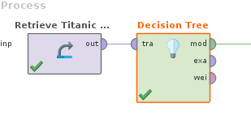
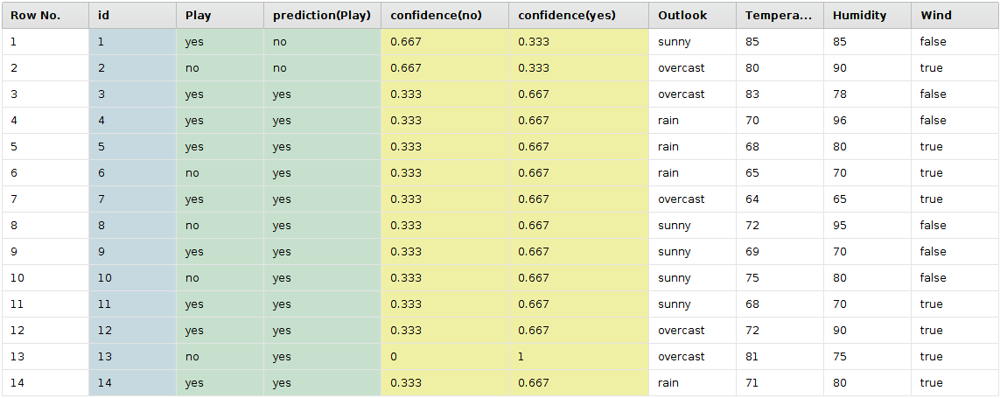

# Machine learning intro

# What is machine learning?

# Types of machine learning

1. Supervised learning 
1. Unsupervised learning
1. Reinforcement 

# Supervised or learning with teacher

Input parameters vector and class to be classified.

# Unsupervised learning without teacher

## kNN

[Nearest neighbor search Wikipedia page](https://en.wikipedia.org/wiki/Nearest_neighbor_search)

## k means 

# Reinforcement learning

[Wikipedia page](https://en.wikipedia.org/wiki/Reinforcement_learning)

An agent takes actions in an environment, which is interpreted into a reward and a representation of the state, which are fed back into the agent.

# F measure

[Wikipedia page](https://en.wikipedia.org/wiki/F1_score)

# 10 fold

