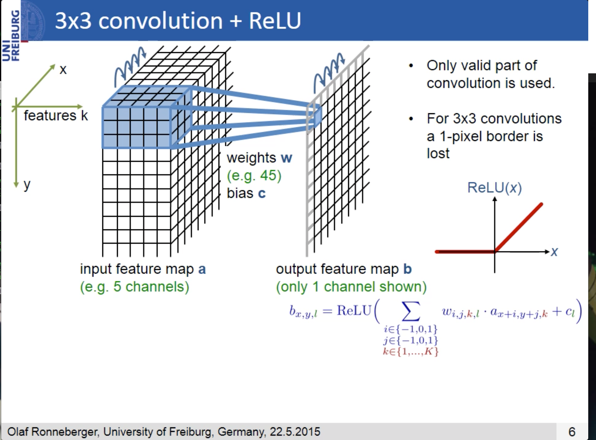

# U-net

## Architecture 

The network architecture is illustrated in Figure 1. It consists of a contracting path (left side) and an expansive path (right side). The contracting path follows the typical architecture of a convolutional network. It consists of the repeated application of two 3x3 convolutions (unpadded convolutions), each followed by a rectified linear unit (ReLU) and a 2x2 max pooling operation with stride 2 for downsampling. 

At each downsampling step, feature channels are doubled. Every step in the expansive path consists of an upsampling of the feature map followed by a 2×2 convolution (up-convolution) that halves the number of feature channels, a concatenation with the correspondingly cropped feature map from the contracting path, and two 3×3 convolutions, each followed by a ReLU. The cropping is necessary due to the loss of border pixels in every convolution.

At the final layer, a 1×1 convolution is used to map each 64-component feature vector to the desired number of classes. In total the network has 23 convolutional layers.

### Operations

### 3x3 convolution

### Max pooling

## Benchmarks

Segmentation results (IOU) on the ISBI cell tracking challenge 2015.

### ISBI cell tracking challange

Result on the ISBI cell tracking challenge. (a) part of an input image of the PhC-U373 data set. (b) Segmentation result (cyan mask) with the manual ground truth (yellow border) (c) input image of the DIC-HeLa data set. (d) Segmentation result (random colored masks) with the manual ground truth (yellow border).

## Retina blood vessels segmentation

## References 

1. [U-Net teaser](https://lmb.informatik.uni-freiburg.de/people/ronneber/u-net/u-net-teaser.mp4)
1. [U-Net: Convolutional Networks for Biomedical Image Segmentation](https://lmb.informatik.uni-freiburg.de/people/ronneber/u-net/)
1. [U-Net: Convolutional Networks for Biomedical Image Segmentation](https://arxiv.org/pdf/1505.04597.pdf)
1. [U-Net: Image Segmentation Network](https://neurohive.io/en/popular-networks/u-net/)
1. [unet-tensorflow-keras](https://github.com/zizhaozhang/unet-tensorflow-keras/blob/master/model.py)
1. [tf_unet](https://github.com/jakeret/tf_unet/blob/master/tf_unet/unet.py)
1. [Pytorch-UNet](https://github.com/milesial/Pytorch-UNet/blob/master/unet/unet_model.py)
1. [retina UNet](https://github.com/orobix/retina-unet)
