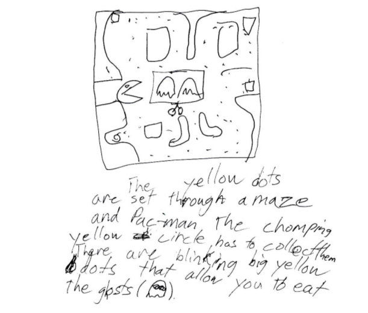
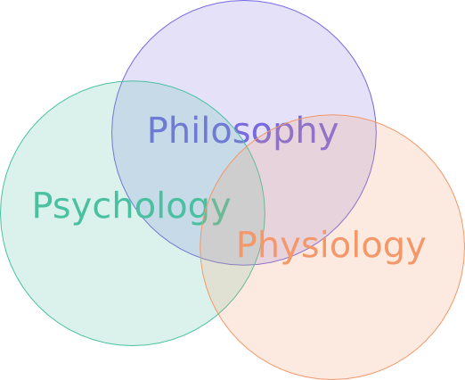
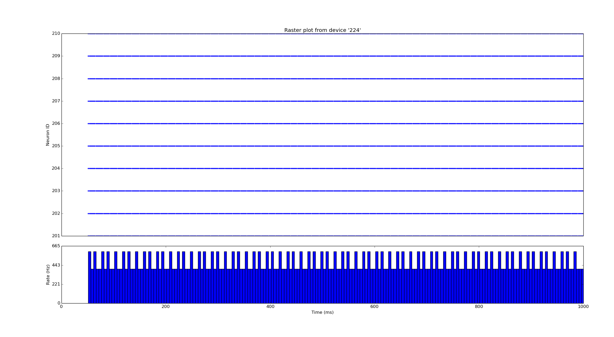
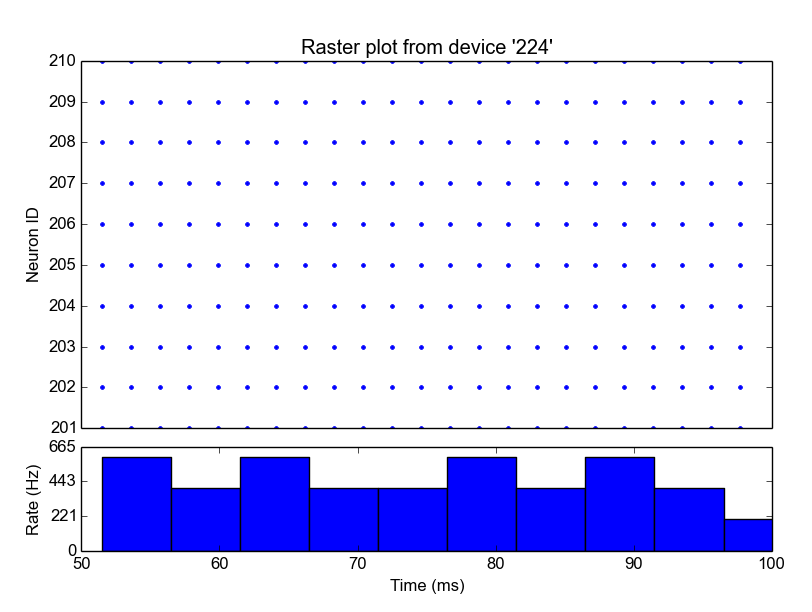
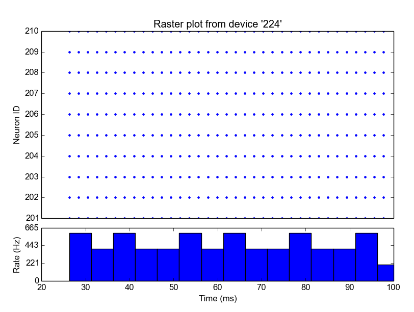

# Trifocal view on complex problems of AI and new bidirectional method Ubique

Max Talanov, Jordi Vallverdu.

## Plan

1. Metafor
1. Issues of GOFAI
1. Machine cognition
1. 

## Metafor

2006: I have hit the article of Henry Liberman and Hugo Liu: "Feasibility studies for programming in natural languages". It was the description of an approach to generate the code on Python based on Natural language description (English), it was implemented in "Metafor":




###Example of processing with Metafor:

**(4) When a customer orders a drink, the bartender tries to make it. When the bartender is asked to make a drink, he makes it and gives it to the customer only if the drink is in the menu's drinks; otherwise, the bartender says "sorry i don't know how to make that drink" to the customer.**

```
class bar:
    the_bartender = bartender()
    the_menu = menu()
class bartender:
    def make(drink):
        if (drink in menu.drinks):
            bartender.make(drink)
            bartender.give(drink, customer)
    	else:
            bartender.say("sorry i don't know how to make that drink", customer)
    def give(drink, to_customer): pass
    def say(quote, to_customer): pass
class menu:
    drinks = [ sour_apple_martini, margarita, rum_and_coke ]
class drink: pass
class apple_martini(drink):
    properties = [“sour”,“sweet”]
class margarita(drink):
    properties = [“sweet”]
class rum_and_coke(drink):
    properties = [“bitter”]
class customer:
    def order(drink):
        bartender.make(drink)
```

###Video

[...](http://web.media.mit.edu/~hugo/demos/metafor-bartender-simple.mov)

## Issues

1. System is too fragile.
1. Not capable of the adaptation to the real life.
1. Not capable of thinking ...
1. Too many stupid rules.

##Machine cognition

**Machine cognition (understanding) <- Machine consciousness <- Machine emotions (affective computations)**

##Method


##Domains correlations



##New domains


##Artificial living systems

1. Intellect is side effect of artificial living NN
1. Artificial living objects:
    2. SCOOP in Eiffel (Simple Concurrent Object-Oriented Programming)
	2. Agents in Scala and Clojure

**Life means feeding and reproduction.**

##Functional vs Holistic methods


## Possible applications

1. Computer games
1. Intellectual assistant capable of emotional dialogs and thinking
1. Automatic interviewers
1. Estimating human responses in the interest of manipulating it
1. Simulations of large social groups
1. Call centre automation
1. Software and hardware support automation
1. Virtual friends
1. Nursing software
1. Applications in emotional robots

##References

1. Lövheim, H. (2012). A new three-dimensional model for emo-
tions and monoamine neurotransmitters,
1. Damasio, A. (1999). The Feeling of What Happens.
1. Minsky, M. (2006). The Emotion Machine: Commonsense Thinking, Artificial Intelligence, and the Future of the Human Mind
1. R.W. Picard (2001), "What Does it Mean for a Computer to "Have" Emotions?," Chapter in "Emotions in Humans and Artifacts,"

##Thank you.

max.talanov@gmail.com

## Sanity testing

### Recurrent NN


The neuromodulation is simulated in primitive way: propagating the output of exit neuron to intermediate layer to 50 percent of neurons (determined randomly).

Training set:

* 1, 2: [0 - 100] and 3, 4: [100 - 255] = 2
* 1, 2: [100 - 255] and 3, 4: [0 - 100] = 1

### Results

Below threshold:

**ANN:**


**RNN:**


Above threshold:

**ANN**


**RNN**


### Spiking NN


Connectivity diagram showing excitatory glutamatergic pathways as red, inhibitory GABAergic pathways as blue, and modulatory dopaminergic pathways as magenta. (Abbreviations: GPe: globus pallidus external; GPi: globus pallidus internal; STN: subthalamic nucleus; SNc: substantia nigra compacta; SNr: substantia nigra reticulata)

The antagonistic functions of the direct and indirect pathways are modulated by the **substantia nigra pars compacta (SNc)**, which produces **dopamine**. In the presence of dopamine, D1-receptors in the basal ganglia stimulate the GABAergic neurons, favoring the direct pathway, and thus increasing movement. The GABAergic neurons of the indirect pathway are stimulated by excitatory neurotransmitters acetylcholine and glutamate. This sets off the indirect pathway that ultimately results in inhibition of upper motor neurons, and less movement. In the presence of dopamine, D2-receptors in the basal ganglia inhibit these GABAergic neurons, which reduces the indirect pathways inhibitory effect. **Dopamine therefore increases the excitatory effect of the direct pathway (causing movement) and reduces the inhibitory effect of the indirect pathway (preventing full inhibition of movement)**. 

This way we simulate:

1. Cortex
1. Striatum
1. GPe: globus pallidus external
1. GPi: globus pallidus internal 
1. STN: subthalamic nucleus
1. SNc: substantia nigra compacta
1. SNr: substantia nigra reticulata

With two main pathways:

**Direct pathway**

**Cortex** (stimulates) -> **Striatum** (inhibits) -> **"SNr-GPi" complex** (less inhibition of thalamus) -> **Thalamus** (stimulates) -> **Cortex** (stimulates) -> **Muscles, etc.**

**Indirect pathway**

**Cortex** (stimulates) -> **Striatum** (inhibits) -> **GPe** (less inhibition of STN) ->**STN** (stimulates) -> **"SNr-GPi" complex** (inhibits) -> **Thalamus** (is stimulating less) -> **Cortex** (is stimulating less) -> Muscles, etc.

Neuromodulation is implemented by SNc via production of the **dopamine** that influences Striatum triggering direct or indirect pathway.

### Results

#### Thalamus

**No Dopamine:**



**Dopamine neuromodulation:**


#### Cortex

**No Dopamine:**



**Dopamine neuromodulation:**



