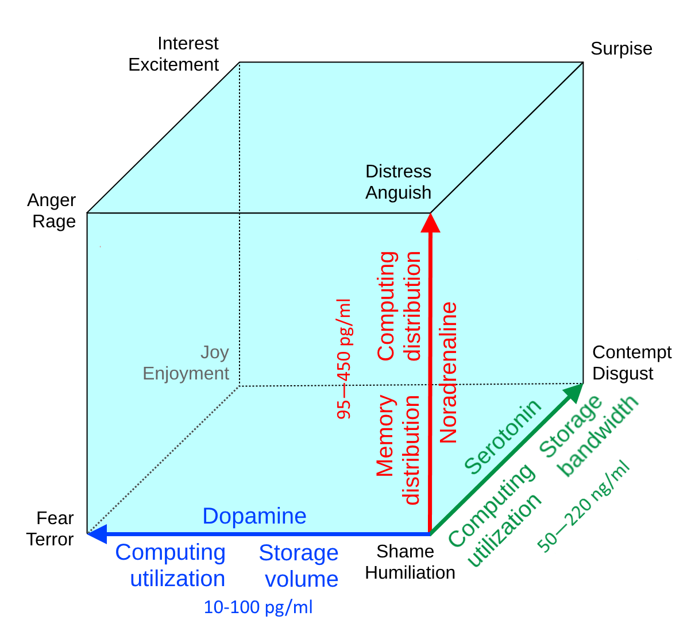
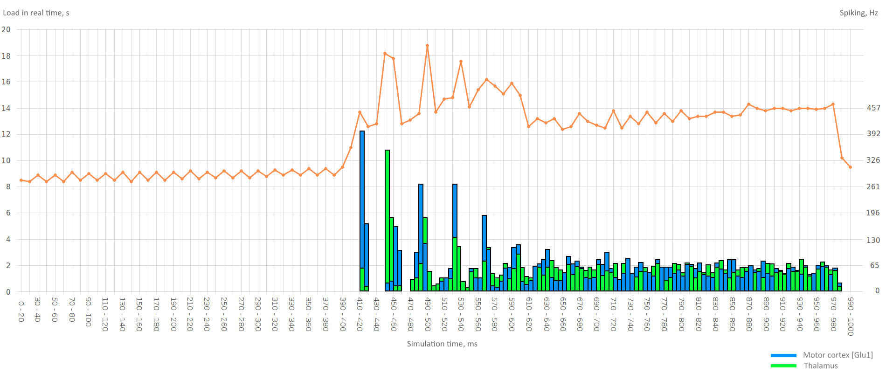
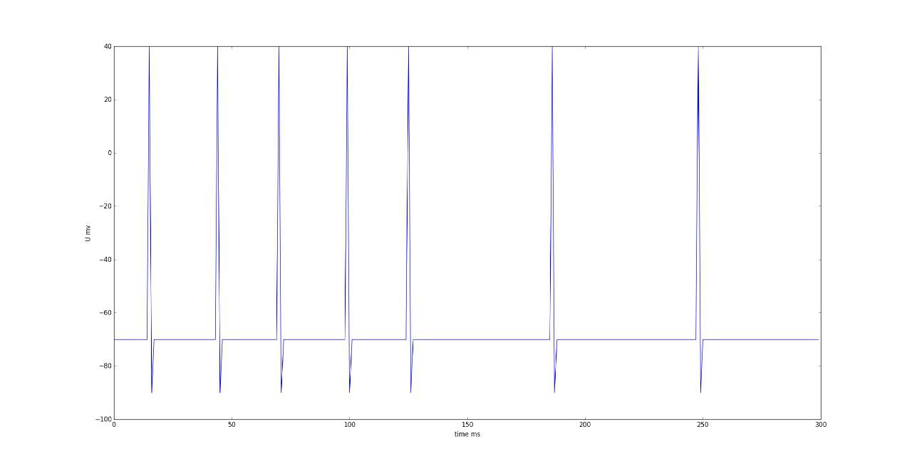

#Affective computing 

Max Talanov, ITIS, KFU (max.talanov@gmail.com)

1. [One practical example](https://github.com/max-talanov/1/blob/master/affective%20computing/one_example.md)

1. [Emotional thinking from bird eye view](https://github.com/max-talanov/1/blob/master/affective%20computing/emotional_thinking.md)

#Projects

##Plan

1. NeuCogAr
1. Robot Dream

##NeuCogAr

Neuromodulating Cognitive Architecture

### Assumption

**Machine cognition (understanding) <- Machine consciousness <- Machine emotions (affective computations)**

###Problem: How do we make machine feel an emotion?

3 perspectives: 

1. Philosophical
1. Psychological
1. Neurobiological

###Idea: Monoamines model

**Noradrenaline** influences overall speed of thinking process, **dopamine** and **serotonin** - reward processing and learning.

 1. Generic:
   2. Computing power load: dopamine, serotonin
   2. Computing power redistribution: noradrenaline
   2. Memory distribution (attention): noradrenaline
   2. Learning: serotonin, dopamine
   2. Storage: serotonin, dopamine
 1. Decision making/reward processing:
   2. Confidence: serotonin
   2. Satisfaction: serotonin
   2. Motivation, wanting: dopamine
   2. Risky choices inclination: noradrenaline
   2. Number of options to process: noradrenaline

#### Generic:

1. *Computing power load* overall load of the computational system is influenced by dopamine and serotonin that makes cortex fire spikes more actively.
1. *Computing power distribution*(computing processes distribution or load balancing) is influenced by noradrenaline the higher is noradrenaline more computing processes should be concentrated on current activity.
1. *Working memory(short term)* distribution is influenced by noradrenaline as neurotransmitter regulating attention.
1. *Learning* is impacted by serotonin and dopamine: dopamine plays major role in activation of previously remembered patterns and serotonin in pattern generation.
1. *Storage* management (long term memory) is influenced both by serotonin and dopamine, higher concentrations of both neurotransmitters the better action is remembered(less probability to forget).

#### Decision making:

1. *Confidence and satisfaction* of the system is directly influenced by serotonin higher serotonin more confident is the system.
1. System is more *motivated* under influence of dopamine.
1. System tends to choose *risky* actions under impact of noradrenaline.
1. Noradrenaline makes system use less *number of options* in width and depth to be processed during reasoning.

###Experiment

####Implementing "cube of emotions"

####Basal ganglia circuit

####Simplified nigrostriatal pathway

####Dopamine pathways diagram

###Results

###Serotonin and disgust

##Robot dream

The integration of a spiking neural network with real-time robotic system

###Problem

###Robot performance

-   **AR-601**: Intel Core i7-4700EQ; 8 GB;

-   **REEM-C**: Intel Core i7 2710QE x 2;

-   **Nao**: Intel Atom @ 1.6 GHz;

-   **iCub**: Intel® Core™2 Duo; 2 GB;

###Required performance

**RIKEN** 2013: 1% of human brain - 250 K-supercomputers (96
computing nodes, 2.0 GHz 8-core SPARC64; 16 GB of memory), slower than
human brain in 1000 times.

**Human brain project**: a whole human brain – 10 exaflop.

###Idea

####Wake and dream

1.  A robotic system transfers the accumulated experience into the
    “Sleeping brain”.
2.  Processing:
    1.  The accumulated experience is transferred from a robotic system
        to the “Sleeping brain”;
    2.  Simulation starts producing a set of updated rules;
3.  The updated rules of the “Sleeping brain” are transferred to the
    robotic system and applied to it.
4.  The robotic system continues it’s job running updated with adjusted
    emotional reactions and accumulating new experience to be processed
    again starting from **A**.

####Translations

####Architecture 

####Robotic system

####Dreaming brain

####Results

## Conformity with Picard criteria

Rosalind Picard in her article "What does it mean for a computer to "have" emotions?" (2001) suggested following criteria to measure emotional capabilities of a computing system:

1. Emotional appearance
1. Multi-level emotion generation
1. Emotional experience
1. Mind-body interactions

Emotional appearance is not discussed in this work. 

Multi-level emotion cognition and behavior generation was demonstrated in "Emotions in six thinking levels" and "Feeling the state and neuromodulation" sections. 

Emotional experience is complex that consists of: "cognitive or semantic label; physiological changes; subjective feeling, intuition" we have scratch the surface and suggested psychological changes mechanism according to Lövheim model and subjective emotions perceptions in this work. 

Mind-body interactions consists of: "conscious and non-conscious events; regulatory and signaling mechanisms; biasing mechanisms, intuition; physiological and biochemical changes; sentic modulation, lying impacts pressure; waveform of love; smiles induce joy..." this partly could be implemented by presented model. 

Conscious and non-conscious mechanisms of stimulus processing was presented. 

Psychological and biochemical changes where presented in "Feeling the state and neuromodulation" and "Neuromodulation to computing system management mapping".

### Thank you

-   Wang, P.: The assumptions on knowledge and resources in models
    of rationality. Int. J. Mach. Conscious. 3(1), 193–218 (2011)

-   Lövheim, H. (2012). A new three-dimensional model for emo- tions and
    monoamine neurotransmitters,

-   Damasio, A. (1999). The Feeling of What Happens.

-   Minsky, M. (2006). The Emotion Machine: Commonsense Thinking,
    Artificial Intelligence, and the Future of the Human Mind

-   R.W. Picard (2001), “What Does it Mean for a Computer to ”Have“
    Emotions?”, Chapter in “Emotions in Humans and Artifacts”
