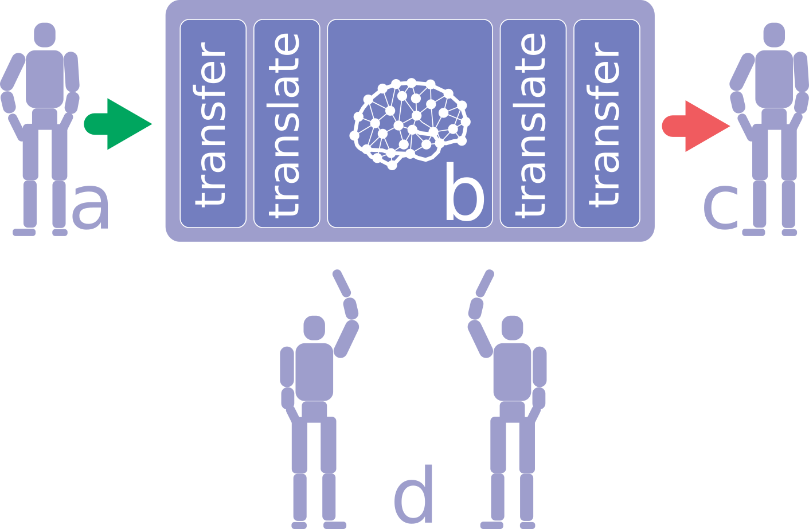

# Neuromorphic Robot Dream: A Spike Based Reasoning System

Max Talanov, ITIS, KFU [max.talanov@gmail.com](max.talanov@gmail.com)

##NeuCogAr

Neuromodulating Cognitive Architecture

### Assumption

**Machine cognition (understanding) <- Machine consciousness <- Machine emotions (affective computations)**

### Idea: Monoamines model

**Noradrenaline** influences overall speed of thinking process, **dopamine** and **serotonin** - reward processing and learning.

### Experiment

#### Basal ganglia circuit

#### Dopamine pathways diagram

### Results

## Robot dream

The integration of a spiking neural network with real-time robotic system

### Problem

### Robot performance

-   **AR-601**: Intel Core i7-4700EQ; 8 GB;

-   **REEM-C**: Intel Core i7 2710QE x 2;

-   **Nao**: Intel Atom @ 1.6 GHz;

-   **iCub**: Intel® Core™2 Duo; 2 GB;

### Required performance

**RIKEN** 2013: 1% of human brain - 250 K-supercomputers (96
computing nodes, 2.0 GHz 8-core SPARC64; 16 GB of memory), slower than
human brain in 1000 times.

**Human brain project**: a whole human brain – 10 exaflop.

### Idea

#### Wake and dream

#### Translations

#### Preliminary results

#### Spike Based Reasoning System

### Acknowledgements

Part of the work was performed according to the Russian Government Program of Competitive Growth of Kazan Federal University.

### References 

-   Wang, P.: The assumptions on knowledge and resources in models
    of rationality. Int. J. Mach. Conscious. 3(1), 193–218 (2011)

-   Lövheim, H. (2012). A new three-dimensional model for emo- tions and
    monoamine neurotransmitters,

-   Damasio, A. (1999). The Feeling of What Happens.

-   Minsky, M. (2006). The Emotion Machine: Commonsense Thinking,
    Artificial Intelligence, and the Future of the Human Mind

-   R.W. Picard (2001), “What Does it Mean for a Computer to ”Have“
    Emotions?”, Chapter in “Emotions in Humans and Artifacts”
