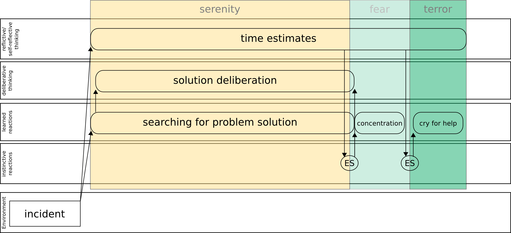

#Emotional thinking from bird eye view

##Orchestra of emotions

Imagine the number of emotions we experience every day, every minute, starting from wake up in the morning till the late evening. Every action or significant change in environment is followed by emotional response. When we were kids and we could not control emotions expressions even wake up and washing the teeth was an emotional scene.

Antonio R. Damasio in his work "Emotion in the perspective of an integrated nervous system" emphasized the effect of emotions: "The ultimate results of emotion are of two kinds. First there are behaviors — the expressing of joy, or anger, or disgust — which affect interactions with other living creatures. Second, there are experiences of emotional states, that is feelings, which affect the ongoing thinking of the subject and by so doing can alter future thinking, future planning and future behavior."

Getting back to practical example: You have got the task on the timely basis: solve some problem in 15 minutes.

1. First of all you are calm and using some learned information to solve the problem.
1. When you realize that there is not that much time left, for example 5 minutes, you start feeling some anxiety and concentrate on the task.
1. Then you realize there is no time left, you start panic (for example :-)), and cry for help.

This is bright example of how do we use emotions in time control to change our actions strategy in everyday life. 

##The emotion machine (Model 6)

First starting point is the philosophy, we use Marvin Minsky book ["The emotion machine"](http://en.wikipedia.org/wiki/The_Emotion_Machine).

Some ideas that I have reused here:

1. 6 mental activities levels model
1. Critic, Selector, Way to think triplet.
1. Consciousness and mind does not have "silver bullet" solution, there are several mechanisms that are always used and involved in the operation of the brain (intelligence).

### Model 6

...

##Psychological view
###Classification of emotions
###Appraisal theory

##Neuroscientific view 

Only main ideas, discussed in details in later lectures

##References

1. [Marvin Minsky lecture consciousness, part 1](http://video.mit.edu/watch/lecture-6-consciousness-1351/)
1. [Marvin Minsky lecture consciousness, part 2](http://video.mit.edu/watch/lecture-7-consciousness-cont-1487/)
