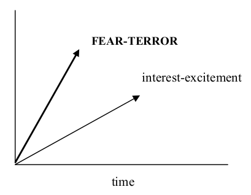
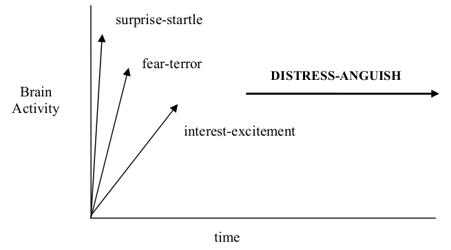
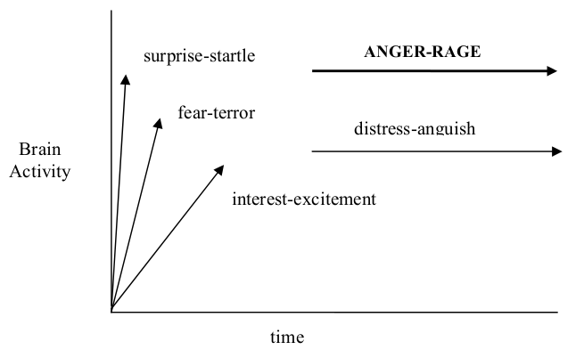

#Psychological models of emotion

##Tomkins Theory of affects

"An affect is a biological event, a normal part of the everyday functioning of our central nervous system (CNS). An affect is, in some respects, like a normal knee jerk reflex. If one applies the proper stimulus to the patellar tendon—a tap with a small hammer—in just the right place with just the right amount of force, then the lower leg will jerk upwards. Similarly, if the proper stimulus is received in the CNS, an affect is triggered."

"stimuli that do not trigger an affect, do not enter into our conscious awareness"

##Sensory homunculus

##9 affects

##Patterns of affects

"When a stimulus is received in our CNS, the instantaneous response of the brain can only be in one of three patterns."

##Increasing Rate Of Brain Activity

###Interest-Excitement

"When interest-excitement is triggered the eyebrows turn down and the face has a “track, look, and listen” appearance. The affects are all visible on the face virtually from birth."

###Fear-terror

"When fear-terror is triggered the eyes become wide open and frozen. The face gets pale, cold, and sweaty and the hair, especially on the back of the neck, becomes erect."

###Surprise-startle

"When surprise-startle is triggered, the eyebrows go up, the eyes blink and the mouth gets an O STEADY."

##State Brain Activity

###Distress-Anguish

"Distress-anguish is triggered whenever there is an above optimal, steady-state pattern of stimulus density."

"The facial response indicative of distress-anguish includes crying, tears, arching of the eyebrows, a mouth with turned down corners and rhythmic sobbing."

###Anger-rage

"The line representing anger-rage in the graph makes it clear that stimuli that trigger it have a pattern that is much denser than that of distress-anguish. This creates a level of brain activity that is way too much. Anger-rage is the affect of overload."

"The facial response when anger-rage is triggered is one we all recognize. The face becomes red, accompanied by a frown and a clenched jaw."

##Decreasing Rate Of Brain Activity

###Enjoyment-Joy

"The face of enjoyment-joy is a pleasure. There is a smile and the lips are widened up and out."

##Plutchik Wheel of emotions

##References

1. [Vernon C. Kelly, Jr., M.D., A Primer Of Affect Psychology](http://www.tomkins.org/uploads/Primer_of_Affect_Psychology.pdf)
1. [Robert Plutchik, The Nature of Emotions](http://www.americanscientist.org/my_amsci/restricted.aspx?act=pdf&id=2762150868143)
